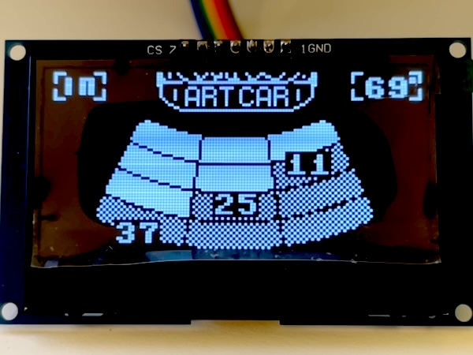
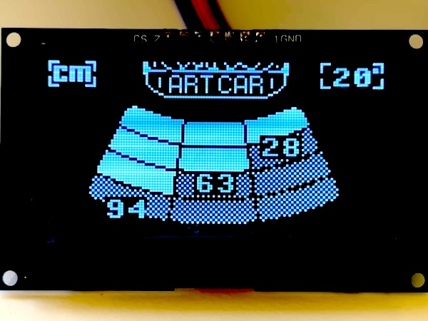
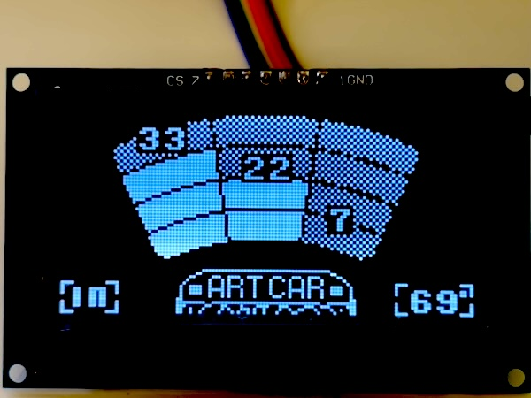

# artcar-ultrasonic-dist-rp2
Raspberry Pi Pico 2 ultrasonic distance - three sensors, can be front/back-facing and has temp/humidity correction, 2024 version
* It was refactored from my Arduino code: https://github.com/bradcar/artcar-ultrasonic-dist-arduino
* To see my Art Car, 5th image down on https://en.wikipedia.org/wiki/Art_car, the one with the caption: "Unofficial BMW Art Car by Tom Cramer..."

## Features of this Raspberry Pi Pico 2 code:
* SSD1309 - uses SSD1306 sw, both SDI & I2C code - SDI is faster
  * ssd1306 Framebuffer-based SW for printing text & blit of bitmap images
* button debounce using efficient interrupt code (does not use CPU cycles with sleep, yay!)
* DHT22 - for temp & humidity
  * Considering BME280 to capture inside temp, humidity, air pressure. and altitude.
* DS18B20 - waterproof outdoor temp that uses onewire protocol
* A02YYUW (PWM), HC-SR04, JSN-SR04T - 1x to 3x Ultrasonic sensors are polled for distances, using PWM which only sends one ping from one sensor at a time and then measures the return time.
  * Picked A02YYUW since it has the best waterproofing and accuracy.
* Temperature from on-board RP2350 (no external pins, machine.ADC(4))
 
## My code is Based on UPIR's GREAT 2022 work: https://github.com/upiir/arduino_parking_sensor
* UPIR youtube channel: https://www.youtube.com/upir_upir
* UPIR youtube full video: https://youtu.be/gg08H-6Z1Lo
* UPIR Github: https://github.com/upiir/arduino_parking_sensor
* UPIR full simulation https://wokwi.com/projects/348388602879672914
* image2cpp (convert images into C code): https://javl.github.io/image2cpp/

## Useful sites:
* Going to use: Foriot's TXS0108E 8 Channel Level Converter Module to convert 5v Ultrasonic and SSD1309 to Support Pico 3.3V signals
  * SSD1309 SDI is fast, so I need one that can keep up https://www.amazon.com/gp/product/B0CFL9KN7L
* Powering Pico: https://www.youtube.com/watch?v=3PH9jzRsb5E -- feed, 5v for ultrasonics, and power in my car.
  * TODO get Buck converter 12v car to 5v (to usb-b or micro-usb)
  * For micro-USB and/or external power, best to have MosFET protection
    * recommended DMG-2305ux, but this is surface-mount MosFET
    * investigating RLB8721, that way can hook laptop up in car to update SW
   
## Project images:
Car display for rear sensors (Imperial units: inches, ft/s, F)

Car display for rear sensors (Metric units: cm, m/s, C)

Car display for front sensors (Imperial units: inches, ft/s, F)

Environment display (Imperial units: inches, ft/s, F)

## Other useful sites (but not used in this code):
* MicroPython Fonts:  https://github.com/peterhinch/micropython-font-to-py/tree/master -- Didn't use it for this project

## Temp and Humidity Correction
Temp correction for the speed of sound is helpful, & humidity correction is minor, but I had a DHT22 which does both, so why not :)
* speed of sound going from 0C to 30C goes from 331.48 m/s to 351.24 m/s (~ 6%)
* speed of sound at 30C goes with a humidity of 0% to 90% goes from 349.38 m/s to 351.24 m/s (~ 0.53%)

## Ideas no longer considering
I decided not to use A02YYUW UART sensors, but to use A02YYUW PWM.  The test code for the UART version is currently in the "sensor-tests" directory in order to help others. 
* Because the UART versions are always broadcasting ultrasonic pings, they seem to interfere with one another if in close proximity  when only a few feet apart.
* Raspberry Pi Pico 2 only offers two UARTs and one is used for communication to a laptop (when needed). In order to get 3 UART ultrasonic sensors on one Pico, one needs extra HW/SW: 
  * HW for dual-UART-to-SDI: https://www.amazon.com/JESSINIE-SC16IS752-Adapter-Conversion-Communication/dp/B0BBLV98ZP/
  * SW for UART-to-SDI: https://github.com/rickkas7/SC16IS7xxRK
