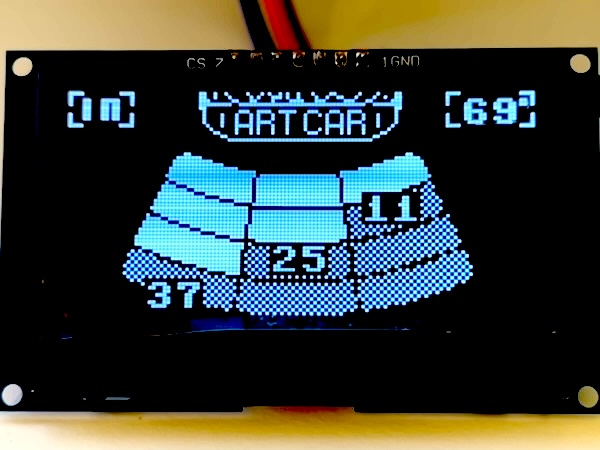
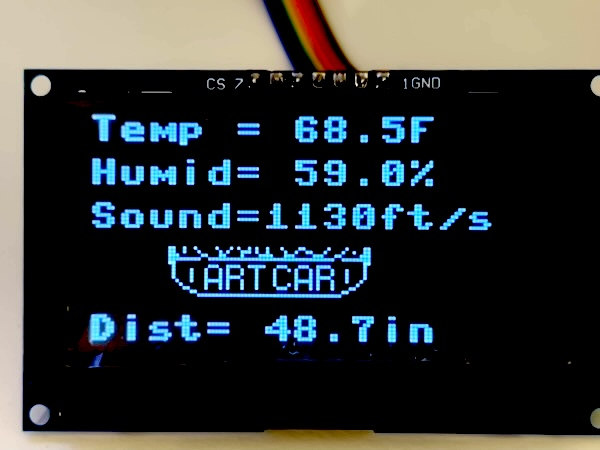

# artcar-ultrasonic-dist-rp2
Raspberry Pi Pico 2 ultrasonic distance - three sensors, can be front/back-facing and has temp/humidity correction, 2024 version
* It was refactored from my Arduino code: https://github.com/bradcar/artcar-ultrasonic-dist-arduino
* To see my Art Car, 5th image down on https://en.wikipedia.org/wiki/Art_car, the one with the caption: "Unofficial BMW Art Car by Tom Cramer..."

## Features of this Raspberry Pi Pico 2 code:
* SSD1309 (SDI) - uses SSD1306 sw, both SDI & I2C code - SDI is faster
  * ssd1306 Framebuffer-based SW for printing text & blit of bitmap images
* A02YYMW (PWM, A0221AM) - 1x to 3x Ultrasonic sensors are polled for distances, using PWM which only sends one ping from one sensor at a time and then measures the return time.
* DS18B20 (onewire) - waterproof outdoor temp that uses onewire protocol, singlewire
* BME680 (I2C) - for inside temp & humidity, air pressure, air quality, and altitude.
  * will place inside outside air input to vent to protect from the weather, in case external temp sensor has issues
* button debounce that uses efficient interrupt code (does not use CPU cycles with sleep, yay!)
* Temperature from on-board RP2350 (no external pins, ADC4)
 
## My code is Based on UPIR's GREAT 2022 work: https://github.com/upiir/arduino_parking_sensor
* UPIR youtube channel: https://www.youtube.com/upir_upir
* UPIR youtube full video: https://youtu.be/gg08H-6Z1Lo
* UPIR Github: https://github.com/upiir/arduino_parking_sensor
* UPIR full simulation https://wokwi.com/projects/348388602879672914
* image2cpp (convert images into C code): https://javl.github.io/image2cpp/

## Useful sites:
* Going to use: Foriot's TXS0108E 8 Channel Level Converter Module to convert 5v Ultrasonic and SSD1309 to Support Pico 3.3V signals
  * SSD1309 SDI is fast, so I need one that can keep up https://www.amazon.com/gp/product/B0CFL9KN7L
* Powering Pico: https://www.youtube.com/watch?v=3PH9jzRsb5E -- feed, 5v for ultrasonics, and power in my car.
  * TODO get Buck converter 12v car to 5v (to usb-b or micro-usb)
  * For micro-USB and/or external power, best to have MosFET protection
    * recommended DMG-2305ux, but this is surface-mount MosFET
    * investigating RLB8721, that way can hook laptop up in car to update SW
   
## Project images:
Car display for rear sensors (Imperial units: inches, ft/s, F)

Car display for rear sensors (Metric units: cm, m/s, C)

Car display for front sensors (Imperial units: inches, ft/s, F)

Environment display (Imperial units: inches, ft/s, F)

## Temp and Humidity Correction
Temp correction for the speed of sound improves accuracty. The humidity correction is minor, but I had a DHT22 which does both, so why not :)
* speed of sound going from 0C to 30C goes from 331.48 m/s to 351.24 m/s (~ 6%)
* speed of sound at going from 10% to 90% humidity at 30C goes from 349.38 m/s to 351.24 m/s (~ 0.53%)

## Other Sensors in sensor-tests directory
* A02YYTW, A02YYUW - Two types of UART sensors A02YYTW (A0221AT, Controlled/target mode), A02YYUW(A0221?, automatic mode) UART. The code in sensor-tests directory is for target, but should work for Automatic, if remove the write to the sensor.
* HC-SR04, JSN-SR04T (PWM), A02YYMW PWM - using PWM which only sends one ping from one sensor at a time and then measures the return time. I picked A02YYMW PWM since it has the best waterproofing and accuracy
* BME280 - temp, humidity, air pressure
* DHT22 - temp & humidity

## Other useful sites (but not used in this code):
* MicroPython Fonts:  https://github.com/peterhinch/micropython-font-to-py/tree/master -- Didn't use it for this project

## Ideas no longer considering
I decided not to use A02YYTW(A0221AT, Controlled/Target UART mode) UART sensors, but to use A02YYMW PWM(A0221AM, PWM) instead.  The test code for the UART is "sensor-tests" directory. 
* Because A02YYUW(A0221?, Automatic mode) UART sensors versions are always broadcasting ultrasonic pings, they seem to interfere with one another when in close proximity (inches to feet apart).
* Raspberry Pi Pico 2 only offers two dedicated UARTs and I use UART0 for communication to a laptop (when needed). In order to get 3 UART ultrasonic sensors on one Pico, one needs extra HW/SW: 
  * HW for dual-UART-to-SDI: https://www.amazon.com/JESSINIE-SC16IS752-Adapter-Conversion-Communication/dp/B0BBLV98ZP/
  * SW for UART-to-SDI: https://github.com/rickkas7/SC16IS7xxRK
 
## TODOs
* Check what length of cat6(twister pair) that can be added to A02YYTW, BME280, DS18B20
* Determine if should run SSD1309 on 5v
* Consider putting air quality status in tiny font
* Consider putting altitude in tiny font, but need to figure out way to input sea level pressure at neareat airport.
